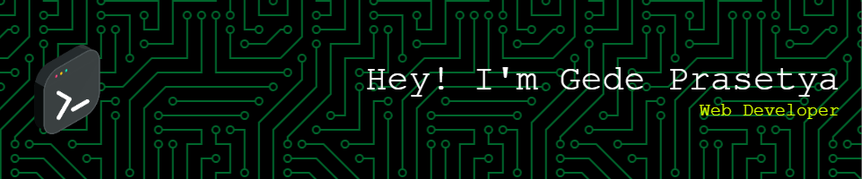

# 🌟 Hey there, I’m Gede Prasetya! 👋  

I’m a **self-taught web developer** from Indonesia who’s passionate about building websites that are fast, useful, and beautiful.  

🚀 Currently on a **#100DaysOfCode Challenge** – pushing code every day, sharing what I learn, and turning ideas into projects!  

---

### 🌱 What I’m working on right now:
- 🔧 Building custom WordPress websites with **Elementor & WooCommerce**
- 📚 Leveling up my **Full-Stack skills** (Laravel, React & Astro)
- 🌐 Experimenting with side projects & blogging about the process  

💡 **What excites me:** solving real problems with code, contributing to open source, and learning from other developers in the community.  

---

### 🔥 Tech Stack & Tools

---

### 📊 GitHub Stats

---

### 📖 Currently Learning
- ⚡ Advanced **Laravel** for full-stack development
- 🏗 Building **custom WordPress themes & plugins**
- 📊 Exploring **Astro + React** for modern, fast web apps

---

### 🌟 Fun Facts About Me
- 🎮 Used to grind hours on **PUBG** – now I grind code.  
- ☕ I probably drink too much coffee while coding.  
- 🏝 Based in Bali – coding between beaches & rice fields.

---

### 🏆 Goals & Milestones
- ✅ Finish **#100DaysOfCode Challenge**
- ✅ Build at least **3 open-source projects**
- 🚀 Start contributing to **other developers’ projects**
- 🎯 Land a **remote web dev job or internship**

---

### 📌 Featured Projects
📂 [**Blog Deprasio**](https://blog-deprasio.vercel.app) – My personal learning blog built with Astro & Tailwind.  
📂 **Upcoming WordPress Theme** – A custom WP theme I’m building from scratch (stay tuned).

---

### 📬 How to Reach Me
- 📧 **Email:** prasetyamahaputra8@gmail.com  
- 🌐 **Portfolio:** [blog-deprasio.vercel.app](https://blog-deprasio.vercel.app)  
- 🔗 **LinkedIn:** [linkedin.com/in/prasetyamahaputra](https://www.linkedin.com/in/prasetyamahaputra/) 
- 🐦 **Twitter/X:** [@gedeprasetya__](https://x.com/gedeprasetya__)

---

⭐️ _“Code is more fun when we build it together.”_
